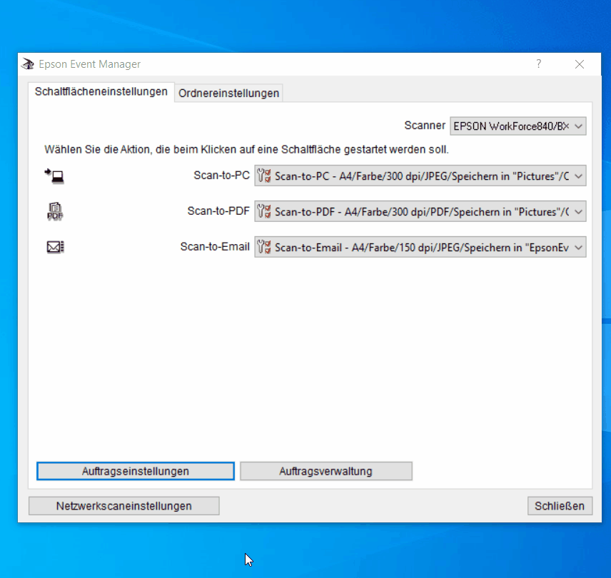
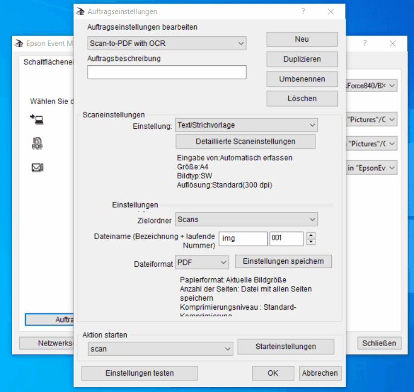

# epsoscanify

### Test results

Branches  | Windows | Test coverage | Security analysis |
----------|---------|---------------|-------------------|
Master:   | [](https://ci.appveyor.com/project/m7b/epsoscanify) | -  | - 


### About

This repo is about using the Epson BX925FWD / Work Force 840 as a PDF scanner
with OCR via NAPS2.

Scanning is done with the Epson Event Manager.
OCR process is done with NAPS2.

### Setup steps

1. Update firmware (not mandatory) and drivers for the epson device
   ([EPSON driver update page](https://epson.com/Support/Printers/All-In-Ones/WorkForce-Series/Epson-WorkForce-840/s/SPT_C11CA97201)).
   
   - Recovery Mode Firmware (for firmware upgrade, optional)
   - Scanner Driver and EPSON Scan Utility
   - Epson Event Manager

2. Install NAPS2 ([Link](https://www.naps2.com/))

3. Install import function and OCR support for preferred language. For this open command promt
   and execute following commands:
   
   ```batch
   CD C:\Program Files (x86)\NAPS2
   NAPS2.Console --install generic-import
   NAPS2.Console --install ocr-eng
   NAPS2.Console --install ocr-deu
   ```

4. Open Epson Event Manager and create a new job

<p align="center">
  
</p>

<p align="center">
  
</p>

5. Settings of the new job. Selecting VBScript to perform OCR.

<p align="center">
  
</p>

6. Assign new created job with button

<p align="center">
  
</p>